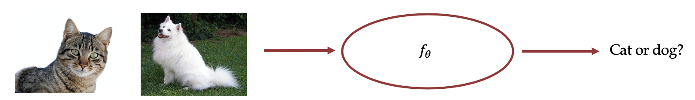
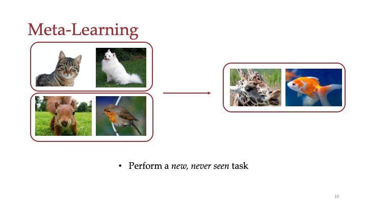
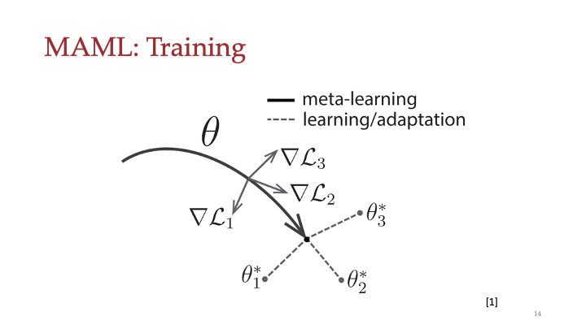
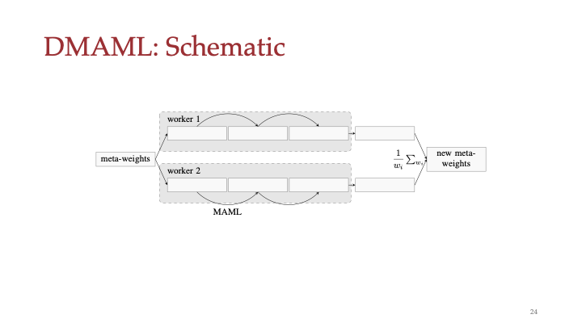
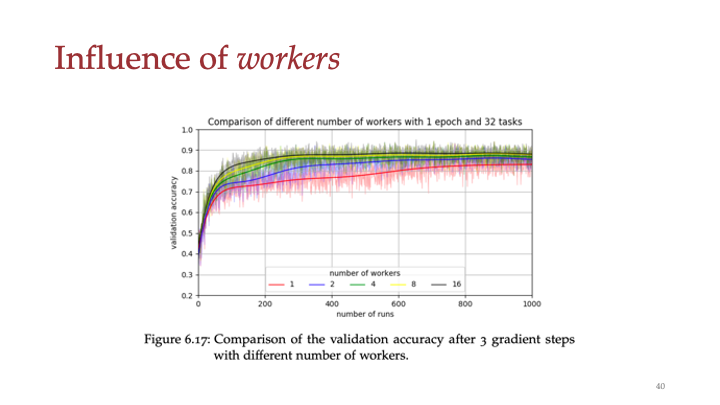
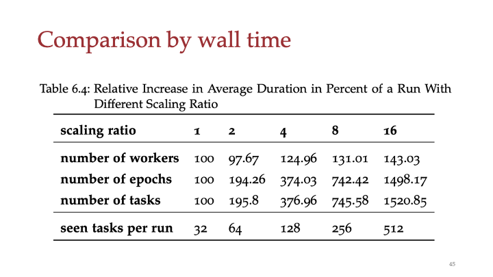

# A Model-Agnostic Meta-Learning Framework for Solving Few-Shot Tasks in Parallel

A master thesis in partial fullfilment of the requirements for the degree of Master of Science

## Introductory Remarks

In this repository I publish my master thesis which deals with parallelization of [MAML](https://arxiv.org/abs/1703.03400), a framework for meta-learning. This master thesis deals with the parallelization of supervised learning tasks such as classification and regression and only theoretically with reinforcement learning tasks. The source code has not yet been published but it may be in future.

I publish my work here in the hope of encouraging others to write scientific theses - I also hope that a few more people read my thesis than just my examiners.

## Few-Shot Problems

Meta-Learning deals with few-shot problems. In few-shot learning tasks, the model (learner) has to learn an entity or goal with only _few_ samples. Few means e. g. 1, 5, 10 so called shots. This is contrary to the widespread standard paradigm, where thousands of samples are needed to train a model. 

| **Figure 1**: Illustration of a Classification Task |
| :-------------------------------------------------: |
|                      |

A classification task could look like illustrated in Figure 1. These problems are callend n-way k-shot problems. In a classification task n describes the number of classes to be distinguished (here 2) and k describes the number of examples of each class given to learn. Thus, the example shows a 2-way 1-shot classifciation problem.

## Meta-Learning

Meta-learning describes a group of algorithms/frameworks that solve this kind of problems. There are more approaches, that deal with few-shot problems. The principle of meta-learning is illustrated in Figure 2.

|     **Figure 2**: Principle of Meta-Learning      |
| :-----------------------------------------------: |
|  |

Meta-Learners are trained with *few* training data with the goal to be able to solve *new* tasks. As you can see in the figure, the meta-learner is trained with its training data (left) and the goal is to be able to solve the new task, to distinguish a giraffe and a goldfish. *New* means in this setting, that the trained classifier is able to distinguish new classes, that it has not seen in the training process. 

## Model-Agnostic Meta-Learning

MAML is one of many approaches in meta-learning. Since it can be applied to any machine learning problem that uses gradient descent, it is very versatile. The main idea behind MAML is to find a good initial model to start from to specialize to a specific task. What does that mean? In classic machine learning problems, you initialize your model randomly and then you train your model with a mass of data. This is called end-to-end training and is the gold standard, because you do not require any domain-specific knowledge. In MAML we want to find a good initialization of the model, to be able to adapt a new task fast. So in the beginning of the training process, we randomly initialize the model and then train it with batches of tasks from the domain, we want to learn. The result is a model, that can deal with various of tasks from the same domain. Take a look on Figure 3. 

| **Figure 3 **: Principle of Model-Agnostic Meta-Learning |
| :------------------------------------------------------: |
|       |

As it can be seen, we have a model theta. We then train (technically on copies of the model) a bunch of tasks and calculate the gradients of the losses and afterwards we train the model theta with the sum (or the arithmetic mean) of all gradients. The three gradients in the figure at their own would change the model towards one specific task, but with the sum (or arithmetic mean) the model changes towards the middle between those tasks.

This way the features that are more often found in the tasks are weighted more heavily in the training process than those that are found only in a few tasks. Thus, the features that are more suitable for a broader range of problems are learned while very task-specific features are not taken over (or only a little). 

After training process we have a model, that is suitable to solve a broad range of tasks. This is illustrated with the arrow that goes right in the middle between the three ideal models for tasks 1,2 and 3. 

After the training process, the model is suitable for *fast-adaption* of one specific new task, which can be learned by only *few gradient* steps.

## Parallelization of MAML

In my work I used an approach which uses a framework written by Jan Bollenbacher and me, Florian Soulier. The idea basically is, to parallelize the MAML algorithm by encapsulating it (Figure 4). 

| **Figure 4**: Principle of Model-Agnostic Meta-Learning |
| :-----------------------------------------------------: |
|                        |

As can be seen, the meta-weights are copied to so called workers, that run in parallel. Those perform MAML steps and after one run the meta-weights of each worker are gathered and merged into the new meta-weights that will be distributed in the next run. 

## Results

| **Figure 5**: Influence of parallelization on the validation accuracy |
| :----------------------------------------------------------: |
|                         |
Figure 5 shows that parallelizing MAML does work. The higher the number of parallel workers, the higher the increase of accuracy per run. But this is not linearly proportional. With higher number of workers it gets apparent, that it does not make sense to increase the number of workers too high. 

| **Figure 6**: Comparison by wall time |
| :-----------------------------------: |
|  |

I found out, that the most important factor for a higher accuracy is the number of seen training tasks (well thats not breaking news). Thus I compared different parameters and increased these so that the number of seen tasks remains the same (see my presentation / thesis for further declaration). Figure 6 shows that increasing these parameters results in a wall time increase (increase about 1500%) that is linear proportional to the scaling ratio except the number of workers (increase by 43%). Thus, increasing the number of workers is efficient in a wall time perspective. Concluding from all my experiments it seems to be **most efficient to parallelize the tasks** instead of the whole MAML algorithm (as we did in our research), since a higher accuracy in total is achieved (but this was not obvious at the beginning of the project) and for complex problems not the meta-learning process but the calculation of the task is the thing, that costs much time.

 [You can find my presentation for overview here](presentation.pdf)

[You can find my master thesis here](thesis.pdf)

The source code may or may not be available at some time here..

Please do not steal my work, you may cite me with following bibtex code:

```
@mastersthesis{Soulier2020,
abstract = {The area of meta-learning is currently enjoying great popularity and new papers are regularly published in this field. There are four popular approaches how such a meta-learner works. In this study, we are dealing with the model-agnostic approach by Finn et al. Since MAML can be applied to all gradient descent based algorithms, it is a very versatile application and research opportunity.

	In this study we implement the MAML algorithm in a way that all three classic use cases, regression, classification and reinforcement learning, are realized together in a single framework in the current TensorFlow and Python versions.  Currently there are only a few implementations in TensorFlow 2 and none that provide all three use cases in a single framework. Furthermore we give the possibility to investigate many different research topics by a large number of controllable hyperparameters without the need to change the source code. 

	Beyond that we extend the MAML algorithm by a parallelization possibility, which is based on top of the MAML algorithm. The idea is based on the success of parallelization algorithms like A3C by Mnih et al. or Ape-X by Horgan et al. from the reinforcement learning area. The research focus of this study is to determine whether the MAML algorithm can be accelerated by parallelization. For this purpose, we propose the DMAML algorithm, an encapsulation of the MAML algorithm, which allows parallelization.},
author = {Soulier, Florian},
title = {A Model-Agnostic Meta-Learning Framework for Solving Few-Shot Tasks in Parallel},
school = {TH Köln (University of Applied Sciences)},
url = {https://github.com/shufflebyte/dmaml},
year = {2020}
month = {may}
}
```

